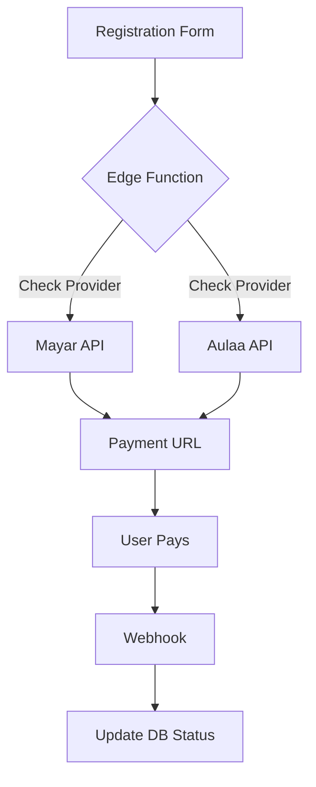

# Plan - Add Aulaa.co Payment Gateway Integration

Add Aulaa.co as a payment gateway option for Fast Track registrations, alongside the existing Mayar integration. Include an admin toggle to switch between providers.

## User Review Required

> [!IMPORTANT]
> - **Aulaa.co API Details**: I will use the standard endpoint `https://api.aulaa.co/v1/payments`. Please ensure you have your Aulaa.co API Key and Webhook Secret ready to input in the Admin panel after implementation.
> - **Webhook URL**: You will need to add the new webhook URL (provided in the Admin panel after this update) to your Aulaa.co dashboard to receive payment confirmations.

## Proposed Changes

### Database & Backend
- Update `site_settings` to include `payment_provider` (default: 'mayar') and `aulaa_config` (API Key, Webhook Secret).
- Update `submit-registration` Edge Function to conditionally create invoices using either Mayar or Aulaa.co based on the active provider.
- Update `mayar-webhook` Edge Function to also handle Aulaa.co webhook signatures and payloads (or create a dedicated `aulaa-webhook` function). *Decision: I will update the existing webhook to be a generic `payment-webhook` or add Aulaa logic to it.*

### Admin Dashboard
- **Integrasi Page**: Add a toggle to select the active payment provider.
- Add configuration fields for Aulaa.co (API Key, Webhook Secret).
- Update the transaction list to show which provider was used.
- Update Sidebar label from "Integrasi Mayar" to "Integrasi Pembayaran".

### Frontend
- Ensure `RegistrationForm.tsx` correctly handles the redirect to the Aulaa.co payment page.

## Technical Details
- **Aulaa.co API**: `POST /v1/payments` with `order_id`, `amount`, `customer_name`, `customer_email`, `customer_phone`.
- **Webhook Verification**: HMAC-SHA256 signature verification using the Webhook Secret.
- **Provider Switching**: A simple string setting in `site_settings` table.

